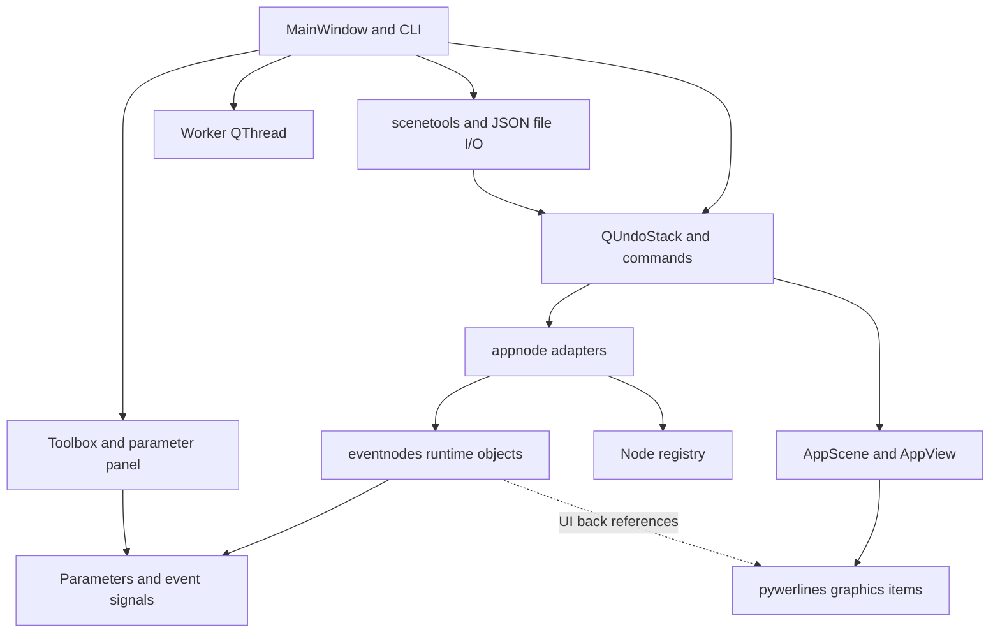
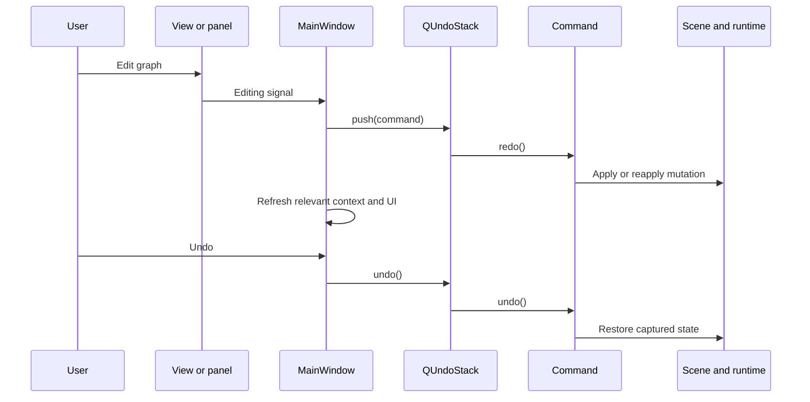
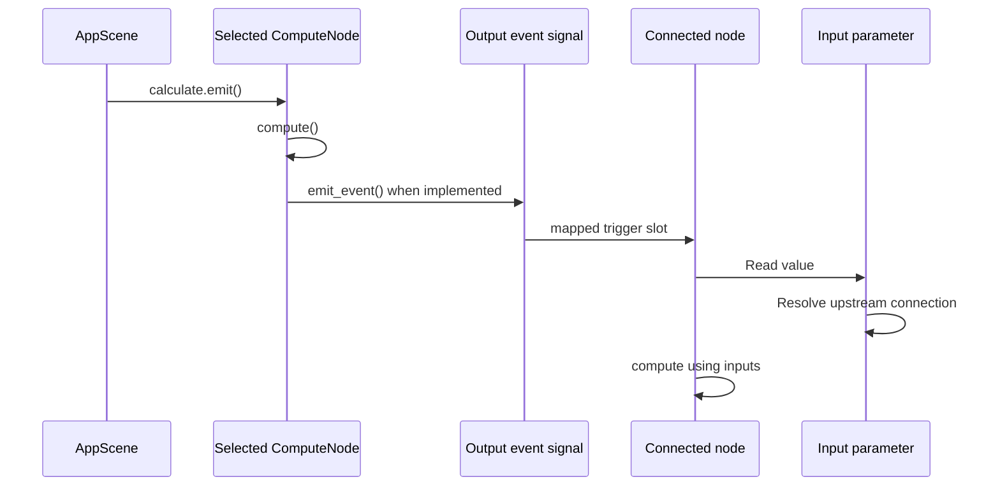

# Subotai architecture: current implementation

This inventory describes the code at `bf9adba` (PySide6 migration), reviewed on
2026-10-02 for [#24](https://github.com/VickenM/Subotai/issues/24).
It records existing behavior and refactoring boundaries. Proposed guarantees are
identified separately; this document does not claim they are implemented.

## Component map

| Component | Responsibilities and source entry points |
| --- | --- |
| Application/session | [`subotai.py`](../subotai.py): `main`, `MainWindow`; builds widgets, dispatches edits, manages files, selection snapshots, worker and tray. [`actions.py`](../actions.py) binds actions; [`config.py`](../config.py) holds defaults. |
| Editor integration | [`appview.py`](../appview.py): drops and context menus. [`appscene.py`](../appscene.py): application connection rules, ID lookup, evaluation and termination hooks. |
| Graphics library | [`pywerlines/pyweritems.py`](../pywerlines/pyweritems.py): nodes, plugs, edges, groups, labels and resizing. [`pywerlines/pywerscene.py`](../pywerlines/pywerscene.py) manages graphical items; [`pywerlines/pywerview.py`](../pywerlines/pywerview.py) handles interaction. |
| Runtime/graphics adapter | [`appnode.py`](../appnode.py): constructs runtime nodes through the registry, creates graphics plugs, links both objects, serializes item attributes, connects/disconnects runtime links. |
| Runtime | [`eventnodes/base.py`](../eventnodes/base.py): `BaseNode`, `ComputeNode`, `EventNode`. Built-in subclasses implement operations, events and computed values. |
| Values and events | [`eventnodes/params.py`](../eventnodes/params.py): typed values, flags, upstream references and serialization. [`eventnodes/signal.py`](../eventnodes/signal.py): named Qt event signals. |
| Discovery | [`register.py`](../register.py): recursively imports built-ins and add-ons and maps unique `type` names to classes. |
| History | [`commands.py`](../commands.py): selection, move, rename, resize, add, remove, connect, disconnect and parameter commands. |
| Persistence | [`scenetools.py`](../scenetools.py): scene extraction and three reconstruction paths; `MainWindow` reads/writes JSON. |
| Panels | [`ui/parameters.py`](../ui/parameters.py) builds parameter editors; [`ui/toolbox.py`](../ui/toolbox.py) exposes registered node types. |
| Worker | [`worker.py`](../worker.py): a `QThread` subclass with no custom scheduler. |

## State and ownership

There is no independent graph document model. The live graph is distributed
between the graphics scene and runtime objects.

| State | Current holder | Saved in JSON? |
| --- | --- | --- |
| Nodes, groups and graphical edges | `AppScene` contains graphics items; plugs also track their edges | Yes, through scene traversal |
| Node identity/type | Runtime `node_obj.obj_id` and class `type`; new adapters allocate UUIDs | Yes, ID as string and module-qualified type label |
| Position, dimensions, title | Graphics node/group | Yes |
| Local parameter value | `Param._value`; `_old_value` supplies parameter undo | Non-`None` values returned by `to_dict()` |
| Connected parameter value | Input `Param.connection` points to upstream parameter; `value` follows it | Connection saved as an edge; resolved value is not the base serializer's source |
| Event connection | Qt signal connected to target slot | Represented by an edge |
| Active state | Runtime node | Yes |
| Dynamic plugs | Node-specific parameter collections plus graphical plugs | No explicit plug schema; recreated through construction/connection callbacks |
| Group membership | `PywerGroup.contained_nodes`, recomputed geometrically on mouse press | No membership list; group geometry is saved |
| Selection and previous scene snapshot | Scene plus `MainWindow.context` | No |
| History and dirty state | `QUndoStack` plus independent `MainWindow.unsaved` flag | No |
| Timers, listeners, processes and loops | Individual node implementations | No general runtime checkpoint |

Graphics items reference runtime nodes through `node_obj`; runtime nodes reference
their graphics through `ui_node`. Undo commands retain direct references to nodes,
parameters and edges, including removed objects. Removing an item for undo is
therefore a different lifecycle operation from clearing the scene.

`context` is a mutable dictionary containing `scene`, `worker`,
`current_selection` and `scene_data`. Commands capture different portions of it
at construction. It is not a transaction or automatically synchronized model.

## Creation and editing

Toolbox activation or a drop reaches `MainWindow.create_new_node`, which pushes
`AddNode`. The command calls `appnode.new_node`, obtains the registered class,
constructs the runtime object and its graphical adapter, moves the runtime object
to the session worker thread, then adds/selects the graphics item on redo.

Some interactions mutate state before creating a command. Movement and resizing
capture old geometry on graphics items; rename reads its previous name from the
context snapshot. Parameter widgets change a parameter before `ParamValue`
captures its current and `_old_value` values. These paths must not be treated as
uniform command-first edits.

`ConnectPlugs` maintains both the graphical edge and runtime link. Event plugs
connect Qt signals to mapped slots; parameter plugs set the target's upstream
reference. `AppScene.can_connect` rejects mixed event/value connections and checks
parameter type equality and occupied inputs. Runtime connection hooks can change
the graph's plug structure: [`FormatString`](../eventnodes/formatstring.py) grows
and removes inputs in response to connections.

Paste, multi-item removal, movement, rename and resize use undo macros. Selection
also enters history. Current `undo`/`redo` handlers refresh the parameter panel,
but do not explicitly refresh `scene_data`, `current_selection` or the dirty flag.
Save resets `unsaved` directly rather than using a stack clean index.

## Execution and session lifecycle

Run calls `AppScene.eval`: it chooses the first selected node and emits
`calculate` if that node is computable. There is no central topological graph
scheduler. Computation propagates through event signals; data is read through
parameter connections, and some parameter subclasses compute values on demand.

`ComputeNode` supplies computation and UI feedback signals. Its computation
decorator catches exceptions, prints them and requests an error glow; it does not
propagate those failures as structured graph execution results. `EventNode` adds
activation controls, including a `QPushButton`, so runtime classes are currently
coupled to Qt Widgets even when the main window is hidden.

`MainWindow.session_start_thread` starts the worker; `AddNode` moves the runtime
QObject to it. This does not establish that all node resources or callbacks run
there: nodes create their own timers, signals, Python threads and event loops.
Direct method calls and references to widgets remain in the implementation.
Thread affinity and shutdown need dedicated verification before promising a
uniform execution contract.

New/open deactivate event nodes, stop the session thread, clear the scene and
start a replacement session. `AppScene.clear` invokes node `terminate` hooks;
the base hook does nothing. Command-based removal uses a different path and does
not itself invoke that hook. The worker stop waits up to ten seconds without
checking the wait result. Closing the window hides it to the tray; explicit Exit
stops the worker and clears the scene. Background CLI mode still constructs the
Qt application and editor objects.

## Saving, opening and pasting

The current JSON root has `nodes`, `edges` and `groups`, with no schema version.
Node fields come from `AppNode.to_dict`; group fields come from
`AppGroup.to_dict`. Edges are endpoint pairs such as `node-id.plug-name`.
Parameter dictionaries are grouped by numeric pluggable flags, which become
string keys in JSON. This format is an implementation snapshot, not yet a
validated interchange contract.

| Path | Identity and reconstruction behavior |
| --- | --- |
| `get_scene_data` | Serializes selected items when selection is truthy, otherwise the entire scene. Includes edges only when both endpoint nodes are included. |
| `MainWindow.load_data` -> `load_macro` | Uses a temporary undo stack and restores saved node/group IDs. |
| `paste_macro` | Uses the session undo stack and retains newly allocated IDs, remapping internal edges and optionally offsetting geometry. |
| `load_scene_data` | Direct scene reconstruction, allocates new IDs and bypasses the command-based node creation path. |

All three loaders duplicate much of this sequence:

1. Resolve a node type using only the final segment of `node_obj`.
2. Construct nodes and apply active state, geometry and title.
3. Reconnect edges sorted by target endpoint text, to accommodate dynamic inputs.
4. Restore parameters, rebuilding lists as `StringParam` elements and assigning
   ordinary values directly to `_value`; enum values receive special handling.
5. Update nodes and construct groups.

Activation therefore precedes full reconstruction. There is no preflight schema
validation or rollback of a partially reconstructed scene. Missing types,
endpoints, or incompatible parameter payloads need explicit handling in the
persistence workstream. `MainWindow.save_file` writes directly to the destination
using `json.dump`; it does not use atomic replacement.

## Extension boundaries

The registry recursively scans built-in `eventnodes` modules. A discovered class
must subclass `BaseNode` and expose a unique `type`. `categories` and `description`
populate toolbox metadata. Import failures and duplicate type names are printed
and skipped. Add-ons use `SUBOTAI_ADDONS`, a `nodes` package and an optional
`modules` directory; discovery imports Python code.

Runtime extension points are `params`, `get_signals`, `compute`, `map_signal`,
activation, `connected_params`, `disconnected_params` and `terminate`. Parameter
names and event names also act as saved endpoint identifiers. Renaming a type or
plug consequently affects saved graphs. Custom parameter `value`/`to_dict`
implementations affect persistence and execution independently.

These are observed conventions, not a stable plugin API. The worked extension
guide and public-contract examples belong to
[#25](https://github.com/VickenM/Subotai/issues/25).

## Follow-up contracts and evidence gaps

| Workstream | Contract to establish and verify |
| --- | --- |
| [Sizing #18](https://github.com/VickenM/Subotai/issues/18) | One content-derived minimum across interactive resize, direct `setSize`, load, paste and undo; recalculate after dynamic plug/title changes. |
| [Persistence #19](https://github.com/VickenM/Subotai/issues/19) | Define persistent versus transient state; preserve identity on open and regenerate it on paste; validate before mutation; reconstruct all supported parameter types and dynamic plugs deterministically. |
| [History #20](https://github.com/VickenM/Subotai/issues/20) | Restore graphical and runtime connections together, define removed-object lifecycle, snapshot mutable values safely, refresh context, and derive dirty state from saved history position. |
| [Typing #12](https://github.com/VickenM/Subotai/issues/12) | Give context, node/plug protocols and serialized records explicit types while keeping Qt object ownership and optional values accurate. |

The existing [`tests/test_pyside6.py`](../tests/test_pyside6.py) covers built-in
construction/panels, example loading/rendering, basic signal execution and a
small history sequence. Example round trips compare graph counts; they do not
prove complete value/identity equivalence. They also disable example event nodes
and do not establish external-service behavior, long history correctness or
resource cleanup. This inventory is based on source inspection; findings above
are audit targets rather than newly reproduced regression reports.

### Baseline investigation (2026-10-02)

Running with `-u -X faulthandler` reproduced an intermittent Windows access
violation while constructing a graphics node in the all-node panel test. A
passing run still emitted the unclosed-event-loop warning, so the warning alone
does not explain the crash. The test created graphics items without scene
ownership and left runtime/graphics reference cycles to garbage collection.

The fixture now adds those items (including Viewer) to the scene for explicit
GUI-thread cleanup and clears history before destroying scene contents. Five
consecutive fresh-process runs of the seven-test suite passed after this change.
This establishes a repeatable baseline for the following work, but does not prove
that every production threading or lifecycle issue is resolved. The unclosed-loop,
unsupported image-parameter and incomplete math-input diagnostics remain.
