# Graph persistence contract: version 1 proposal

Status: proposed specification for [#28](https://github.com/VickenM/Subotai/issues/28),
based on `9e77b2f`. The application still reads/writes the existing unversioned
format. This change supplies a contract, schema, inventory and validation examples;
runtime serialization/migration belongs to #29 and exhaustive round-trip tests to #30.

## In plain English

A saved graph should remember the nodes, settings, wiring, names and layout you
created. It should also remember useful stored values, such as the Counter's
current count and the Collector's pending items. Reopening a file must not restart
a download, resend an email, or repeat a half-finished operation merely because
those operations were running when it was saved.

We keep JSON and add a format version so future releases can recognize and
upgrade old files. “Accurate restoration” means restoring the persistent state
defined here, not resuming the Python process or its active jobs.

## Artifacts and scope

- [Built-in inventory](builtin-inventory.md): all 44 types, constructor parameters,
  event ports, flags and default expressions, including inherited promotion fields.
- [Machine-readable schema](graph-v1.schema.json): the proposed structural format,
  using [JSON Schema Draft 2020-12](https://json-schema.org/draft/2020-12/json-schema-core).
- [Example document](example-v1.json): a Counter with stored count 7 connected to
  a ConsoleWriter, enclosed by a graphical group. This is a specification fixture;
  do not open it in the current application's legacy loader.
- [Architecture inventory](../architecture.md) explains current ownership and
  reconstruction; [node sizing](../node-sizing.md) defines size normalization.

## What the current implementation does

[`AppNode.to_dict`](../../appnode.py) writes ID, module-qualified type, name,
position, dimensions, active state and parameters grouped by numeric flags.
`Param.to_dict` returns the local `_value`, not the value resolved through a
connection. `None` is omitted by the node serializer, so absence and explicit null
cannot currently be distinguished. `ListParam` strips element wrappers to their
local values; reconstruction wraps every element as `StringParam` regardless of
its original type. Enum classes inherit `int`, so their ordinal values reach JSON.

[`scenetools.py`](../../scenetools.py) represents endpoints as `node-id.plug-name`,
looks up node types by the last dotted segment, sorts edges to trigger dynamic
input creation, and activates nodes before parameters/connections are complete.
The three loaders duplicate this logic. Open preserves IDs in `load_macro`, while
paste and the direct loader allocate new ones. There is no atomic validation or
rollback. [ImageParam](../../eventnodes/image/imageparam.py) and
[QueueParam](../../eventnodes/apilistener.py) explicitly omit their payloads.

Some semantically important state is elsewhere: Collector `_items`, directory
watcher baselines, UI-only process concurrency and runtime resource handles.
The policies below explicitly decide what each one means for a saved document.

## Persistent graph and editor state

| State | Version 1 contract |
| --- | --- |
| Node identity/type | Stable opaque string `id`; namespaced type ID and integer `type_version`. Built-ins use `subotai:<type>` (including `subotai:Brightness/Contrast`). Module paths are legacy aliases, never import instructions from a file. |
| Names/layout | Save node/group caption, scene position and requested dimensions. Font, theme, plug colors and class descriptions come from installed implementations. |
| Activation | `enabled` stores intended activation; it is applied only after complete validation and reconstruction. It does not mean “job currently running.” |
| Parameters | Explicit records for every persistent local value, including constructor defaults, null, hidden `NONE` flags, promotion fields, and unconnected input fallback values. Never evaluate a connected or computed value just to save it. |
| Ports | Ordered records for **all** value/event ports, including dynamic ports and unused trailing inputs. Stable local IDs are distinct from editable display names. |
| Connections | Each edge has an opaque ID and structured source/target `{node_id, port_id}` references. Preserve edge-array order as connection registration order for event fan-out; no promise of completion order across asynchronous work. |
| Node-specific state | `state` contains only explicitly declared persistent entries encoded with the same value format as parameters. It is not a dump of `__dict__`. |
| Groups | ID, caption, position and size. Current groups are geometric containers, not semantic parents: preserve geometry, and recompute drag membership as today. Do not invent nested membership or execution ownership. Explicit grouping semantics require a later schema change. |
| Selection/history/clipboard | Session-only; start empty after file open. Clipboard uses the same records but changes identity on paste. |
| Viewport/session UI | Zoom, pan, dock sizes, viewer visibility/window geometry and selection are session preferences, not graph state in v1. |
| Processes/resources | Threads, timers, Python/Qt references, queues, sockets, listeners, open files, UI controls, progress and in-flight jobs are excluded. Recreate them under the lifecycle rules below. |

Node, edge and group IDs share one document-wide namespace. New IDs are UUID4
strings, but the schema permits any nonempty opaque string for compatibility.
IDs survive save/open and undo restoration. Copy includes selected nodes/groups
and only edges whose two endpoint nodes are included; an empty selection copies
nothing. Paste allocates new node/group/edge IDs and remaps every internal
reference. Port and parameter IDs remain local to their node and do not change.

## Parameter values and defaults

Each parameter has `id`, `name`, `flags` (0–7, matching existing bits) and a typed
`value`. IDs are stable registry bindings, initially `input:<name>`,
`output:<name>` or `property:<name>` for built-ins. `PARAM` does not change that
binding. A future implementation with input and output flags on one parameter
must declare one binding referenced by both ports. Display-name changes must not
silently change IDs. Renaming a binding needs a type migration.

Examples: `{"codec":"int","data":7}`, `{"codec":"string","data":""}`,
`{"codec":"null","data":null}`. Integer and float codecs remain distinct even
when the JSON number is mathematically integral. Boolean is not an integer.
Preserve Unicode and strings verbatim, including relative paths; loading does not
canonicalize paths or read referenced files. A relative path keeps the current
working-directory interpretation until a separate path-policy change is designed.

Enums use stable member names (for example `add`), interpreted by the node's
versioned parameter manifest. Lists contain typed values recursively; they are
not universally strings. An `object` value maps string keys to typed values.
Custom codecs use a namespaced ID and positive integer codec version, with a
JSON-compatible `data` payload whose schema is supplied by the installed codec.
No pickle, Python expression evaluation or file-specified imports are allowed.

For v1, **all declared persistent parameter records are required** by semantic
validation. Missing is an error, while a null value is data where the manifest
allows null. Schema `default` annotations do not fill missing records. Legacy
missing fields use the frozen legacy defaults in the inventory, not defaults of
whatever node version happens to be installed in the future. Computed and
transient bindings intentionally have no parameter value record, but their ports
are still present. The node manifest distinguishes these cases.

Passwords currently behave as ordinary strings. V1 preserves that behavior:
Email's configured password is persistent plaintext, and a password UI mask is
not encryption. Test fixtures contain no credentials. A credential-reference
feature would require an explicit future policy, not silent omission in this
accuracy refactor.

## Node-specific state policies

The inventory lists every parameter; this table defines exceptions and the
additional state that constructor declarations alone cannot capture. Unless
excluded below, preserve **every local scalar/list/enum parameter**, including
stored output values. Restoring an output does not emit an event.

| Nodes | Additional policy |
| --- | --- |
| StringParameter, IntegerParameter, FloatParameter, BooleanParameter | Preserve `param`, `promote state`, and nullable `promote name`; rebuild controls with signals blocked so restoring widgets cannot overwrite values. |
| Counter | Preserve `initial`, `increment`, and current output `value`; do not reset the saved count during reconstruction. |
| Collector | Preserve local `item`, output `items` and the pending `_items` buffer as typed `state.pending_items`. Legacy files never stored that buffer; migration initializes it to an empty list and reports the limitation. |
| FormatString, JoinStringsMulti | Preserve format/separator and every dynamic string input's local value and identity, including unused trailing inputs. Output `JoinParam` is derived, with no saved cache. Persist actual port order; reconstruction must not create/remove ports as a side effect of connecting edges. |
| JoinStrings, IntToStr, Math, SliceList | Preserve source settings/inputs (including Math operation and SliceList input list). Their `JoinParam`, `ToStr`, `MathParam`, `SliceParam` outputs are derived; reconstruct getters, never snapshot their backing defaults as results. |
| Condition | Persist operation by member name and both numeric local inputs; no running branch state. |
| For, ForEach | Preserve configuration and stored `current`/`item`/`index`/`count` outputs, but not an executing iterator or loop position. Next trigger starts the normal loop anew. |
| ListDir, SplitString, CurrentDir | Preserve local inputs and stored output lists/directory. Do not scan directories or recompute results on open. |
| DirChanged | Preserve configured directory and saved `new`/`removed` outputs. Discard `current_contents`; create a fresh filesystem baseline only on activation, without synthesizing change events for the time the file was closed. |
| FilesChanged, Hotkey, Timer | Preserve files/hotkey/interval and intended activation. Rebuild watchers/listener/timer after construction; no pending callbacks, held-key state or remaining timer duration. Timer starts a fresh interval on activation. |
| CopyFile, ZipFile, UnzipFile | Preserve source/destination settings and the stored output path. Do not perform a file operation on reconstruction. |
| Process | Preserve command/arguments; no subprocess, PID, return state or automatic replay. |
| MultiProcess | Preserve command/arguments and the `concurrency` parameter. UI spinner is currently initialized independently (1 versus parameter default 0); the parameter is authoritative, and the UI must synchronize to it. Legacy 0 remains 0 (paused scheduling), not silently changed. Pending/running jobs, progress, logs and subprocess handles are transient; no jobs resume. |
| Download | Preserve URL, configured filename and last output filename. Discard in-flight tasks, counters and progress widgets; do not restart downloads on open. |
| APIListener, APIRequest | Preserve request/response strings. Queue payloads and queued requests are transient. Recreate an empty queue on the listener and reconnect the request node to that queue through its value edge. No network requests run during reconstruction. |
| Email, ConsoleWriter | Preserve all declared local settings; never send email or print a saved message as part of load. |
| OpenImage | Preserve file and stored width/height, exclude Pillow image output; loading does not open the image file. A subsequent trigger reloads it. |
| BlendImage, Brightness/Contrast, Color, CropImage, ResizeImage, Rotate, ThumbnailImage, Translate, SaveImage | Preserve non-image settings (including enum blend mode) and edges. All ImageParam buffers are transient, even those carrying the PARAM flag. Reconstruct as `None` (including CropImage's legacy empty-string image default). No image operation runs on open. |
| Viewer, SystemNotification | Preserve ordinary parameters and edges; image/icon buffers are transient. Rebuild viewer controls without showing a window or sending notifications until requested. Viewer display pixels/visibility are session-only. |

Image buffers are excluded because they are runtime payloads, not workflow
configuration. V1 does not promise pixel-for-pixel process checkpointing. A
future user-configurable image asset must use an explicit file/asset codec; it
must not be silently lost as an unregistered custom value. Likewise unknown
non-JSON objects are errors, never `str(object)` or omitted values.

## Ports, dynamic inputs and add-ons

### Nodes describe their own state

The authoritative declarations belong to the node classes (and their parameter
classes), alongside the behavior they describe. The built-in inventory is
**documentation only**: it is not a runtime catalog, a loader input, or a second
hand-maintained definition of parameters. Once declarations exist in #29, that
reference should be generated from them without constructing or activating nodes.
The existing registry remains the mechanism for finding an installed node class
by its stable type ID; it does not duplicate the class's state declarations.

Here, a node's **manifest** means its own declarative description: type/version,
parameter bindings and codecs, defaults and constraints, persistence policy,
port definitions/dynamic families, and additional persistent fields. Most nodes
inherit save/restore behavior from the base class. They do not each implement
JSON encoding, file access or a separate parameter traversal algorithm.

| Owner | Responsibility |
| --- | --- |
| Node and parameter classes | Describe local state; distinguish persistent, derived and transient values; declare extra fields and dynamic ports; provide exceptional conversion/migration behavior when necessary. |
| Shared state serializer | Walk those declarations, deep-copy local values, apply registered codecs, validate records and invoke optional hooks. Never evaluate a derived getter to save a node. |
| Graph loader/registry | Resolve type IDs, validate the complete document, create inactive instances, restore all local state/ports, and then reconnect edges and activate event sources. |
| Editor adapter | Capture/restore captions, positions, dimensions and groups; normalize sizes after the node's content exists. |
| Document/file layer | Encode/decode JSON, migrate document versions, report errors and write files atomically. |

The generic node envelope in the schema remains unchanged. Its `type` and
`type_version` select the installed class and its declarations. The shared layer
can therefore interpret `parameters`, `ports` and `state` for different node
types without hard-coded branches for every built-in node.

### Declarations first, custom hooks when necessary

Ordinary scalar/list/enum parameters need no custom hook. Persistent fields
outside `params` should also be declarative when possible: Collector can declare
its `_items` buffer as the typed `state.pending_items` field. Shared dynamic-port
support should cover FormatString and JoinStringsMulti so each does not have to
implement its own reconstruction algorithm.

A node may override small state hooks when a declaration cannot express its
conversion or restoration behavior. The following is illustrative pseudocode,
not a shipped API or a requirement to add these exact methods to every node:

```python
def save_state(self):
    return {"pending_items": list(self._items)}

def restore_state(self, state):
    self._items = list(state["pending_items"])
```

Those hooks exchange logical structured values with the shared serializer, which
applies the declared codecs to produce the schema's typed value envelopes. They
do not parse JSON text, write files, serialize neighboring nodes, or reconnect
edges. The example's list copy is sufficient only for immutable string items;
the shared snapshot boundary must detach nested mutable values as well.

Hook output is subject to the same declared keys, codecs, versions and validation
as automatically serialized state. Hooks cannot silently add undeclared fields
or replace the node/graph envelope. A save hook must not mutate the live node or
perform external I/O. A restore hook runs on an inactive staging node, with no
execution or external effects. It must leave all required ports available before
edge reconstruction. A failure aborts staging and leaves the current graph intact.
Changing a hook's stored representation requires a type/codec version migration.

Recreation order is explicit: validate data against class declarations; construct
inactive nodes; restore parameters and additional state; restore declared dynamic
ports (or invoke an exceptional port-restoration hook); connect edges only after
every node and port exists; synchronize editor state; then apply activation.
The shared implementation owns this order, even for nodes with custom hooks.

A port record carries an opaque local `id`, display `name`, `direction`, `kind`
(`value` or `event`) and stable `binding`. For value ports, binding names a
parameter in the node manifest, including computed/transient parameters that
have no stored value. For event ports, it names a declared event/trigger. For
example, Counter's `value:output:value` binds `output:value`; its
`event:input:reset` binds `reset`. IDs are never parsed by splitting on dots.

Static ports must match the type manifest. Dynamic ports must match its declared
dynamic family. Preserve their array order within each direction and kind;
binding IDs survive disconnect/reconnect. For the existing string families,
require contiguous `string1` through `stringN`, with at least one input, and keep
the saved unused trailing input. Recreate all parameters/ports **before** edges.
An unused last input can contain a local value and must not disappear on load.

Add-ons register a stable namespaced type ID, aliases for old type names,
`type_version`, parameter/port/state manifests, codecs and pure migration
functions. Constructors must support inert creation; restore must not execute a
workflow. Manifest metadata supplies expected codecs, nullability, numeric
constraints and dynamic-family rules. Any persistent non-parameter field must
be explicitly declared in `state`. Unknown fields cannot be blindly assigned to
Python objects. Data migrations operate on document records without Qt objects.

Missing type, unknown codec, unsupported type version or unknown state key is a
load error that names the node and missing dependency. The existing document
remains untouched. V1 does not implement lossy placeholders or partial loading.
This makes absence of an add-on visible rather than dropping its data.

## Versions and migration from today's JSON

The root discriminator is `format: "subotai.graph"` and `schema_version: 1`.
Type/codec versions evolve independently inside that document version. Writers
emit only the current supported version. Future versions are rejected with an
upgrade message; don't guess at compatibility. Adding/removing/changing required
document fields increments the document version. Type-level changes increment
`type_version` and provide a pure migration.

Unversioned roots with `nodes`, `edges`, `groups` are legacy v0. Migration runs on
a detached copy and preserves the original file. Unknown root versions are not
treated as v0. The initial v0-to-v1 migration must:

1. Validate root shapes and reject duplicate keys, nonfinite numbers, malformed
   endpoint strings and duplicate IDs before constructing anything.
2. Resolve each module-qualified `node_obj` through a registered legacy alias.
   Do not discard the module prefix for arbitrary add-ons; ambiguous aliases fail.
3. Preserve node/group IDs, names, position and `active` as `enabled`. Missing
   name/size/active follows the legacy defaults (class caption, 100×100 node size,
   true); required missing IDs/positions/types fail. Groups require geometry;
   missing legacy group IDs receive deterministic migration IDs.
4. Convert flag-keyed parameter dictionaries using the frozen manifest: keys are
   integers 0–7; unknown names/flags fail with their location. Restore missing
   declared values from legacy defaults; preserve explicit null only when allowed.
   Convert enum ordinals by the legacy enum mapping, not new enum order. Rebuild
   list elements according to their declared element types. Ignore legacy cached
   backing values of known computed outputs with a migration diagnostic.
5. For string dynamic families, compute required numeric indices from both
   parameter records and endpoints; materialize missing intermediate indices and
   one unused trailing input when the final input is connected. Preserve existing
   unconnected local values. Numeric indexing avoids lexical `string10` ordering.
6. Split a legacy endpoint into its node ID and remaining plug name, resolve
   direction from source/target position, then resolve event/value kind through
   the manifest. Ambiguous names fail. Assign deterministic edge IDs based on
   original edge-array index, avoiding document ID collisions; retain array order.
7. Initialize unavailable persistent state (Collector's buffer) with documented
   defaults. Exclude image/queue payloads and transient resources. Record every
   information-losing conversion as a diagnostic, without including passwords.
8. Run full v1 validation, then apply the normal reconstruction pipeline.

The inventory's default expressions must become frozen literal data in #29;
never evaluate those Python expressions from the file. Enum mappings to freeze:
Math `1:add, 2:subtract, 3:multiply, 4:divide, 5:modulo`; Condition
`1:less_than, 2:greater_than, 3:equal`; BlendImage `1:multiply, 2:soft_light,
3:hard_light, 4:overlay`. Unknown ordinals fail. All six existing examples remain
legacy fixtures and must continue to import under #30.

## Reconstruction and activation timing

```mermaid
flowchart LR
    A[Parse strictly] --> B[Migrate detached data]
    B --> C[Validate structure and semantics]
    C --> D[Construct inert nodes and ports]
    D --> E[Restore local values and state]
    E --> F[Wire edges in saved order]
    F --> G[Sync UI and normalize sizes]
    G --> H[Replace document atomically]
    H --> I[Apply intended activation]
```



Before commit, no watcher, timer, network consumer, viewer window or process may
start. Suppress parameter-widget signals and dynamic connection callbacks while
restoring. Allocate inert resource descriptors first; live resources are created
only at the final activation stage. Existing constructors with side effects must
be refactored in #29 to make this possible. `enabled` for an ordinary compute
node does not imply a trigger; only event-source activation starts monitoring.

Failure before replacement disposes the staging graph and keeps the current
document and history intact. Activation failure after replacement keeps the
document, leaves the affected source inactive, and reports a runtime error;
never silently rewrite its saved enabled intent. Save uses a consistent snapshot
of persistent state at an event boundary, rejecting a busy snapshot if a node
cannot provide one safely. It does not record half-updated counters/buffers.
Write strict UTF-8 JSON to a temporary sibling, flush, and atomically replace the
destination only after successful serialization. Saving never mutates the graph.

Restore geometry only after dynamic ports/labels are present. Normalize dimensions
to the current content minimum; preserve larger dimensions and position. This is
an intentional difference from byte equality (fonts/platforms can change minimum
sizes). Save the normalized dimensions; a second open under the same layout
conditions must stabilize. Report normalization, not a corrupt-file error.

## Validation beyond JSON Schema

The schema checks record shapes and typed value envelopes. The following are
mandatory semantic checks in #29, **not claims about what the schema alone does**:

- Unique node/group/edge IDs globally; unique parameter and port IDs per node.
- Complete parameter/port/state manifests, codec compatibility, nullability,
  enum members, finite floats, parameter bounds and known versions/types/codecs.
- Every edge references existing ports; source is output, target is input,
  kinds match, and value types satisfy the existing exact-type rule. At most one
  incoming value edge; reject duplicate endpoint pairs and same-node edges to
  match current UI behavior. Multiple event connections remain allowed.
- Reject value-dependency cycles that cause recursive `Param.value` evaluation;
  account for each node's internal computed-output dependencies. Event cycles
  are permitted by the current editor, so importing one is not itself an error;
  execution safeguards belong to runtime work.
- IDs in state are forbidden unless the manifest declares them as references
  with a copy/paste remapping policy. Enforce document size/depth limits before
  allocating widgets or decoding custom payloads.

Diagnostics have a document path, code, node/port identity where applicable and a
human-readable explanation. Validation must not print parameter payloads. Unknown
properties are rejected except inside a codec's validated payload. JSON object
key order is irrelevant; node/group order is canonicalized by ID, parameter order
by binding ID, while port, edge and list order are preserved.

## Shared correctness contract for persistence and history

For supported persistent states, `decode(encode(snapshot))` is semantically equal:
same identities, type versions, local typed values, explicit null/defaults,
dynamic port order, wiring order, captions, enabled intent and declared state,
with the documented geometry normalization. No evaluation or external effects
may be needed to establish equality. Derived/transient values are not part of it.

Undo/redo must restore the same persistent state and object references/selection
needed by the editor, but does not undo emails, files or other external effects.
History records must deep-copy mutable lists/buffers; a later compute must not
rewrite an earlier snapshot. Deleting and undoing a node restores its ID, ports,
incident edges and persistent state without replaying a running job. This is an
input to #31/#32, not an assertion that existing commands already satisfy it.

## Implementation handoff

| Follow-up | Required evidence |
| --- | --- |
| #29 | Put authoritative declarations on node/parameter classes; implement inherited serialization, declarative extra fields and dynamic ports, with optional validated hooks. Separate snapshot/codec, strict parser, pure migrations, semantic validation, inert construction and atomic file I/O; enforce the lifecycle/manifest contracts above. Generate the readable inventory from declarations without executing constructors. |
| #30 | Round-trip every built-in's persistent state, including nondefault/null/list/enum values, output caches, Collector buffer, promotion and dynamic string1–string12; all six v0 examples; unavailable add-ons, malformed endpoints, duplicates, unknown versions and failed-load rollback. Verify no side effects on parse/load and stable second-save geometry. |
| #31 | Reproduce history failures against the same snapshot contract, especially mutable values, dynamic ports, deleted nodes, dirty state and activation. |

Run the structural specification checks with
`python -m unittest discover -s tests -p test_persistence_spec.py -v` after
installing `requirements-dev.txt`. They validate the schema and examples and
check inventory coverage. They do not implement or test a new runtime loader.
