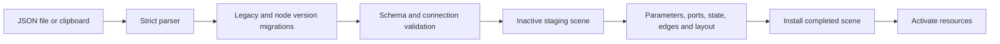

# Saving and restoring graphs

Nodes describe their persistent parameters and event ports in class declarations.
The shared persistence pipeline uses those declarations to write JSON and recreate
the scene. The [inventory](builtin-inventory.md) is generated documentation; the
loader never reads it.

## Where the code lives

- [persistence.py](../../persistence.py) handles typed values, strict JSON parsing,
  custom codecs, inert construction and atomic file replacement.
- [graph_document.py](../../graph_document.py) handles scene snapshots, migrations,
  semantic validation, staging and activation.
- [scenetools.py](../../scenetools.py) shares that pipeline with clipboard operations.
  Paste assigns fresh node, edge and group IDs and remaps edge endpoints. One undo
  command owns the inserted graph and pauses its resources when undone.
- [subotai.py](../../subotai.py) coordinates document replacement and error dialogs.
  Validation and reconstruction finish before the old scene or history is cleared.

## Declaring a node

`parameter_definitions` maps stable bindings, such as `input:initial`, to
`ParameterDefinition` objects. Constructors use `create_parameter` so runtime
defaults and persistence defaults come from the same source. `signal_definitions`
does the same for event ports. A parameter's storage policy is `stored`, `derived`
or `transient`. Stored values include explicit null and disconnected fallback
values; connected inputs do not evaluate upstream nodes while saving.

`state_fields` declares extra persistent state outside parameters. Collector uses
it for pending items. The inherited `save_state` and `restore_state` hooks suffice
for simple attributes. An unusual node may override those hooks, but must still
declare every state field and return supported typed values. Runtime handles,
threads and active jobs are not persistent state.

Add-ons must supply a namespaced `persistence_type` and stable bindings. A node
can advance `type_version` and provide `type_migrations`, keyed by the old version,
whose functions return the next record version while preserving its identity.
Custom value types use a registered, namespaced `ValueCodec`; unknown codecs or
versions produce an error instead of silently converting data to strings.

## Failure behavior

The parser rejects duplicate keys and nonfinite numbers. Validation checks IDs,
types, declared parameters, ports, connections and value dependencies. Nodes are
constructed inertly, dynamic ports are restored before edges, and activation is
deferred until installation. A failed staging operation leaves the open scene
and undo history intact. Activation errors are reported after installation;
the document remains available for correction.

Saving takes a detached snapshot under node state locks and refuses busy nodes.
It serializes before touching the destination, writes a temporary sibling file,
flushes it and replaces the destination atomically. A failed save keeps the old
file. Saving does not resume or checkpoint running jobs.

Legacy unversioned graphs are migrated in memory and subsequently saved as
version 1. State absent from legacy files receives declared defaults; data never
saved by an older version cannot be recovered. Node sizes below the content
minimum are expanded during restoration.

## Verification and documentation

Run `python -m unittest discover -s tests -v` for the regression suite and
`python tools/generate_node_inventory.py` to refresh the inventory. The suite
covers default round trips for all 44 built-in types, example migration, dynamic
ports, clipboard undo/redo, stored state, strict parsing and failure rollback.
Issue #30 tracks the broader non-default round-trip matrix; #31 tracks the
editor-wide undo/redo audit.
